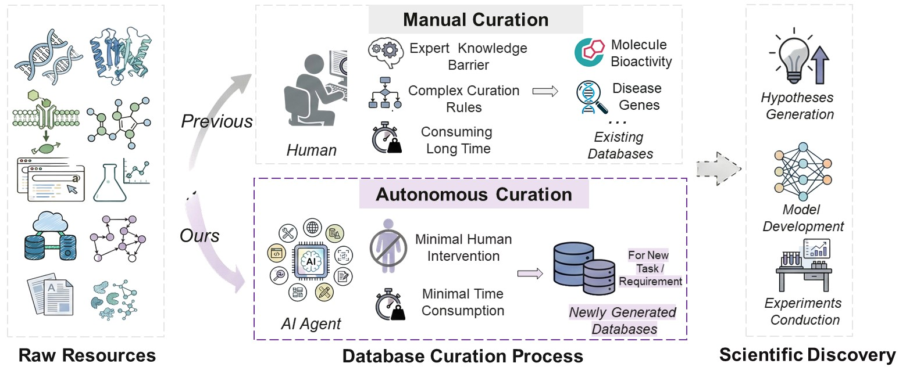
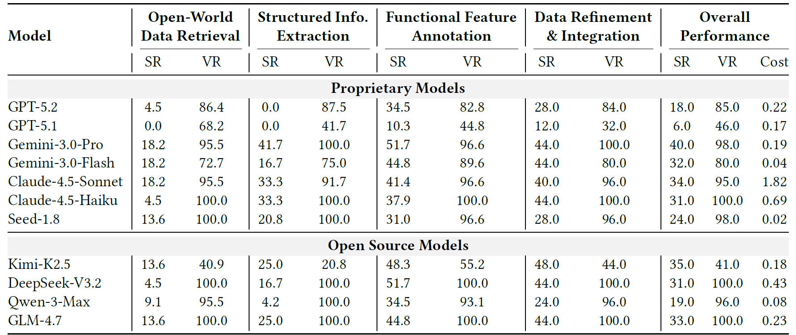

<!--  -->
# BioDataLab
This is the offical implement of "BioDataLab: Benchmarking LLM Agents on Real-World Biological Database Curation for Data-Driven Scientific Discovery".




## Benchmark Access


## Quick Start

### Install the envrironment
```bash
conda create -f environment.yml
```
### LLMs API 
Setting the LLM API_KEY and BASE_URL in `assistant\llm.py`.
```python
API_KEY = ""
BASE_URL = ""
```

### Basic Usage of BioDataLab
Evaluate on one task:
```bash
conda activate biomni_e1
python3 run_evaluate_case_biomni.py --task_yaml=benchmark/tasks/fusionneoantigen_annotate_2.yaml
```
Run bash scirpt on all tasks
```bash
conda activate biomni_e1
bash evaluate_bash_scripts\run_evaluate_batch_biomni_gemini-3-flash-preview.sh
```

## Evaluation Results


## Contributors
**Student Contributors**: Jiaxian Yan*, Xi Fang, Chenmin Wu, Jintao Zhu, Yuhang Yang, [Zaixi Zhang](https://zaixizhang.github.io/), Meijing Fang, and Chenxi Du

**Supervisors**: [Qi Liu](http://staff.ustc.edu.cn/~qiliuql/), [Kai Zhang](http://home.ustc.edu.cn/~sa517494/)

**Affiliation**: State Key Laboratory of Cognitive Intelligence, USTC; Peking University; Princeton University; Zhejiang University, Tsinghua University

## Contact
We welcome all forms of feedback! Please raise an issue for bugs, questions, or suggestions. This helps our team address common problems efficiently and builds a more productive community. If you encounter any issues, please reach out to jiaxianyan@mail.ustc.edu.cn.

## License
This project is licensed under the terms of the MIT license.

## Citation
If you find our work helpful, please kindly cite:
```
@article {Yan2025.04.22.648951,
	author = {Yan, Jiaxian and Fang, Xi and Zhu, Jintao and Wu, Chenmin and Yang, Yuhang and Fang, Meijing and Du, Chenxi and Zhang, Kai and Zhang, Zaixi and Liu, Qi},
	title = {Benchmarking LLM Agents on Real-World Biological Database Curation for Data-Driven Scientific Discovery},
	year = {2026},
	journal = {underview}
}
```
